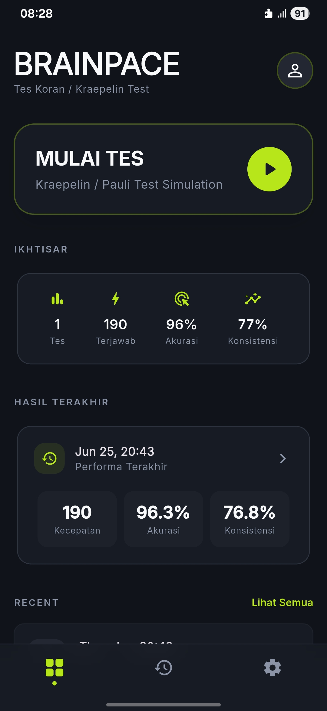
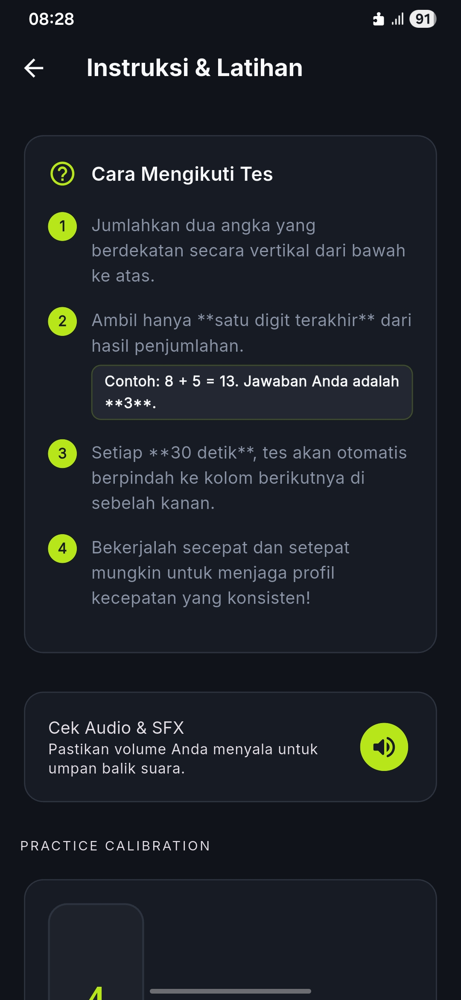
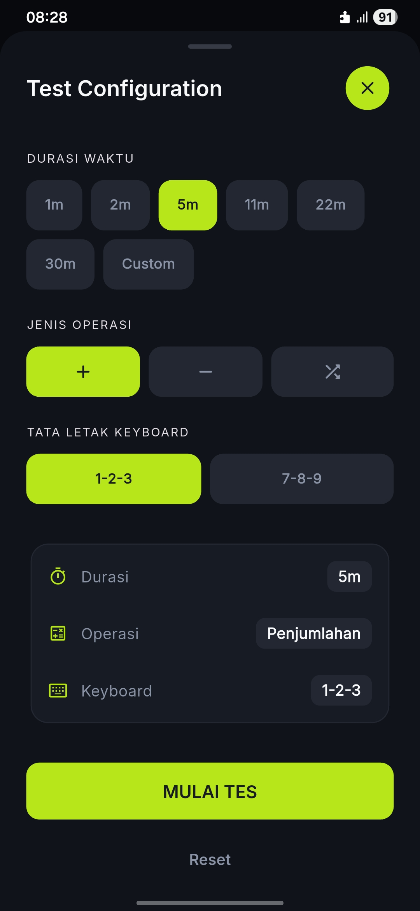
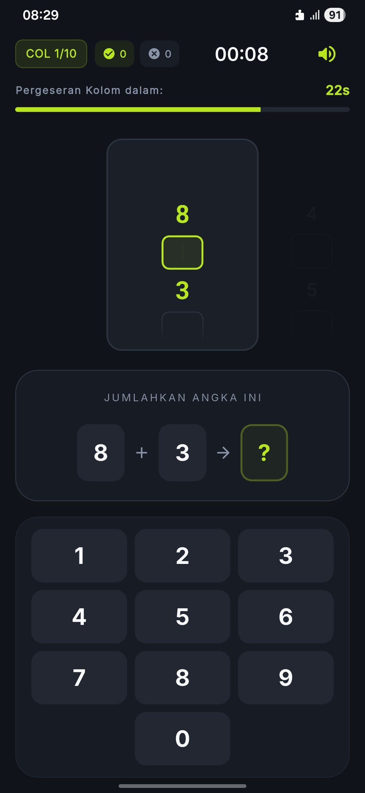
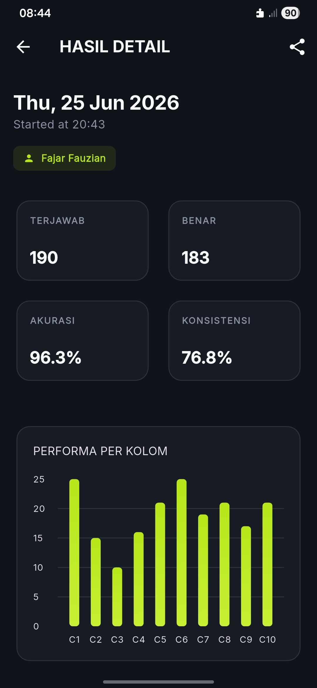
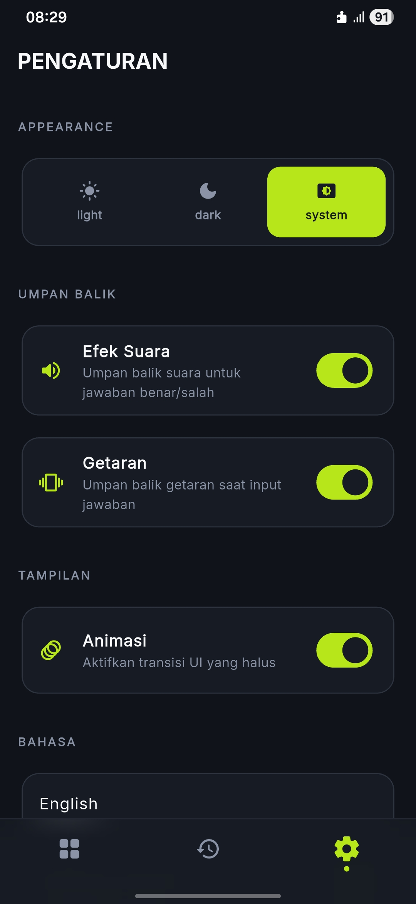

# BrainPace

**BrainPace** adalah aplikasi mobile berbasis Flutter yang dirancang untuk simulasi dan latihan **Tes Koran (Kraepelin / Pauli Test)**. Aplikasi ini membantu pengguna melatih fokus, kecepatan berhitung, akurasi, dan konsistensi mental melalui antarmuka yang modern, premium, dan responsif.

---

## 🚀 Fitur Utama

- **Simulasi Tes Koran (Kraepelin / Pauli)**: Mode latihan interaktif untuk penambahan angka beruntun dengan durasi dan jenis operasi matematika yang dapat disesuaikan.
- **Analisis & Statistik Lengkap**: Menampilkan performa terkini melalui grafik (line & bar chart) untuk metrik Kecepatan (Pace), Akurasi, dan Konsistensi.
- **Sistem Audio Responsif**: Efek suara (*chime* dan *buzzer*) yang responsif tanpa lag untuk membantu kalibrasi jawaban benar/salah secara langsung.
- **Riwayat Tes Terintegrasi**: Daftar riwayat tes yang rapi dengan dukungan pencarian, penyaringan, serta fitur hapus banyak entri (*bulk delete*).
- **Tema Dinamis & Responsif**: Transisi mulus (*smooth transition*) antara Mode Gelap (Dark Mode) dan Mode Terang (Light Mode) dengan palet warna minimalis premium (Lime Green & Charcoal Black).
- **Multi-bahasa**: Mendukung Bahasa Indonesia dan Bahasa Inggris.

---

## 📸 Antarmuka Aplikasi

Berikut adalah beberapa tampilan halaman dari aplikasi BrainPace:

| Home / Dashboard | Instruksi Tes | Panel Pengaturan Tes |
| :---: | :---: | :---: |
|  |  |  |

| Halaman Tes (Gameplay) | Detail Hasil Tes | Pengaturan Aplikasi |
| :---: | :---: | :---: |
|  |  |  |

---

## 🛠️ Cara Menjalankan Project

### Prasyarat
Sebelum memulai, pastikan Anda telah menginstal:
- [Flutter SDK](https://docs.flutter.dev/get-started/install) (versi stabil terbaru)
- [Android Studio / VS Code](https://docs.flutter.dev/get-started/editor) dengan ekstensi Flutter & Dart terpasang
- Perangkat fisik Android/iOS yang terhubung atau emulator/simulator aktif

### Langkah Setup

1. **Clone repositori ini:**
   ```bash
   git clone https://github.com/zianscode/mobile-brainspace.git
   cd mobile-brainspace
   ```

2. **Dapatkan dependensi Flutter:**
   ```bash
   flutter pub get
   ```

3. **Jalankan Aplikasi:**
   - Untuk menjalankan di perangkat/emulator yang terhubung dalam mode debug:
     ```bash
     flutter run
     ```
   - Untuk melihat daftar perangkat yang terhubung:
     ```bash
     flutter devices
     ```

4. **Build Aplikasi (Opsional):**
   - Build Android APK:
     ```bash
     flutter build apk --release
     ```
   - Build iOS App Bundle (membutuhkan macOS & Xcode):
     ```bash
     flutter build ipa --release
     ```
